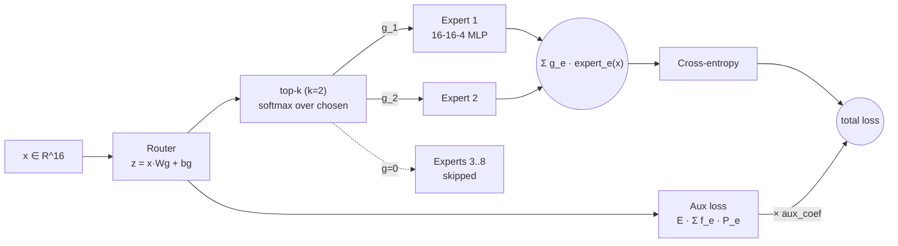

# ai-learn-24-mixture-of-experts

A Mixture-of-Experts layer from scratch in NumPy: a top-k softmax router, MLP experts, manual backprop through the
sparse gates, and a Switch-style load-balancing auxiliary loss. We compare it with dense MLPs that have the same
**active** parameters (and the same **total** parameters) on a multi-cluster task where each cluster follows its own rule.

Part of the AI learning series (after `ai-learn-11-lora-scratch` … `ai-learn-14-end-to-end-ai-assistant`).

## Architecture



## What you'll learn
- How top-k routing works: pick k experts per token, renormalise their gates, and backprop through the selected gates only.
- Why routers collapse onto a few experts, and how the Switch load-balancing loss (`E·Σ f_e·P_e`) spreads the load.
- "Active vs total params": a sparse model gets more capacity per unit of compute than a dense model.
- Why top-1 with renormalised gates gives the router no task gradient (the single gate is always 1).

## Layout
| file | purpose |
|---|---|
| `moe.py` | MoE layer: router, top-k gating, experts, forward/backward, aux loss, param counts |
| `dense.py` | Multi-cluster task generator, dense MLP baseline, Adam, cross-entropy |
| `train.py` | Training loops for dense and MoE (with aux coefficient) |
| `run_smoke.py` | Full experiment: dense (equal active / equal total) vs MoE aux sweep → `results/` |
| `smoke_plots.py` | SVG plots + RESULTS.md writer |
| `svg_utils.py` | Makes SVGs smaller so they are easy to diff |
| `notebooks/mixture_of_experts.ipynb` | Step-by-step walkthrough |
| `results/` | `RESULTS.md`, `metrics.json`, `JSON.shot`, SVG plots from the real smoke run |

## Run
```bash
pip install -r requirements.txt
python run_smoke.py          # ~8 s on CPU, seed 42, writes results/
jupyter notebook notebooks/mixture_of_experts.ipynb
```

## Results (seed 42, from `results/metrics.json`)
| model | active / total params | test acc | dead experts | load CV |
|---|---|---|---|---|
| dense, equal active (H=39) | 823 / 823 | 0.7435 | - | - |
| dense, equal total (H=136) | 2860 / 2860 | 0.7965 | - | - |
| MoE top-2, no aux | 816 / 2856 | 0.832 | 1 | 0.404 |
| MoE top-2, aux=0.1 | 816 / 2856 | **0.839** | 0 | 0.129 |
| MoE top-2, aux=1.0 | 816 / 2856 | 0.8355 | 0 | 0.057 |

The aux loss revives the dead expert (min utilization goes from 0.0013 to 0.0948 at aux=0.1) and makes the load more uniform.
Accuracy is about the same across the sweep (0.832–0.839). See [results/RESULTS.md](results/RESULTS.md).

## Caveats
- All experts are computed densely for clarity. Unselected experts get an exact zero gate, so the maths equals sparse dispatch, but no speedup is measured.
- No capacity factor, token dropping, noisy gating or expert parallelism.
- One seed on a synthetic task that is built to favour specialisation.

## Next steps
- Add noisy top-k gating and a capacity factor with token dropping.
- Router z-loss, and expert-choice routing.
- Swap the MoE in for the FFN of the mini-transformer from ai-learn-04.
