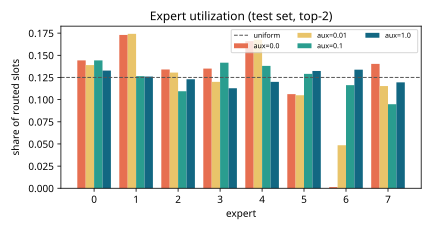
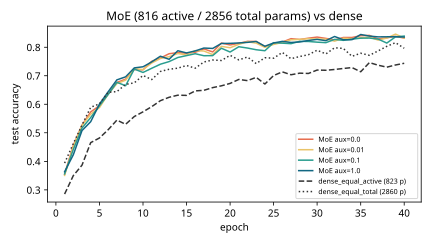
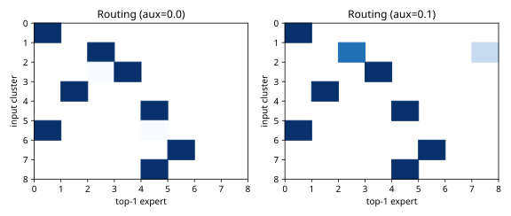

# Results: ai-learn-24-mixture-of-experts

Real output of `python run_smoke.py` (seed 42, CPU, 7.97 s wall time).

## Setup
- Task: 8 well-separated Gaussian clusters in 16-D. Each cluster labels its points with its own random linear rule
  (4 classes). 4000 train and 2000 test points.
- MoE: 8 ReLU-MLP experts (16-16-4), a linear softmax router, top-2 gating renormalised over the chosen experts,
  and a Switch-style aux loss `E * sum_e f_e P_e`. 40 epochs of Adam (lr 0.003, batch 64). The init seed is the same for every run.
- Dense baselines are ReLU MLPs whose hidden width matches the MoE's **active** params per token, or its **total** params.
- A dead expert gets less than 0.02 of routed slots. Purity is the share of each cluster's points sent to that cluster's most-used top-1 expert.

## Results
| model | active / total params | test acc | dead experts | min util | max util | load CV | util entropy | cluster purity |
|---|---|---|---|---|---|---|---|---|
| dense_equal_active (H=39) | 823 / 823 | 0.7435 | - | - | - | - | - | - |
| dense_equal_total (H=136) | 2860 / 2860 | 0.7965 | - | - | - | - | - | - |
| MoE top-2, aux=0.0 | 816 / 2856 | 0.832 | 1 | 0.0013 | 0.173 | 0.4043 | 0.9342 | 0.977 |
| MoE top-2, aux=0.01 | 816 / 2856 | 0.832 | 0 | 0.0485 | 0.1742 | 0.2944 | 0.9765 | 0.9815 |
| MoE top-2, aux=0.1 | 816 / 2856 | 0.839 | 0 | 0.0948 | 0.1442 | 0.1287 | 0.9959 | 0.968 |
| MoE top-2, aux=1.0 | 816 / 2856 | 0.8355 | 0 | 0.1128 | 0.1338 | 0.0565 | 0.9992 | 0.9685 |

## Plots

## Observations (from the numbers above)
- At equal active params the MoE scores 0.832 (no aux) vs 0.7435 for the dense MLP. It even beats the dense MLP with
  equal *total* params (0.7965). The router learns to send each cluster to a small set of experts that can specialise.
- Without the aux loss, 1 expert(s) end up nearly unused (min utilization 0.0013, load CV 0.4043).
  With aux=0.1: 0 dead experts, min utilization 0.0948, load CV 0.1287.
- Accuracy barely moves with the aux coefficient: it spans 0.832-0.839 across the sweep, which is within single-seed noise.
  On this small single-device task the aux loss mainly buys balanced load (which matters for throughput when experts sit on different devices),
  not accuracy. Cluster purity stays high (0.968-0.9815), so balancing did not destroy specialisation.

## Honest notes
- Every expert is computed densely for all tokens (E is tiny). Unselected experts get an exact zero gate, so the maths matches sparse dispatch,
  but no speedup is measured. There is no capacity factor and no token dropping.
- One seed on a synthetic task. With renormalised gates and top-1, the router gets no gradient from the task loss (the single gate is always 1),
  which is why this repo uses top-2.
